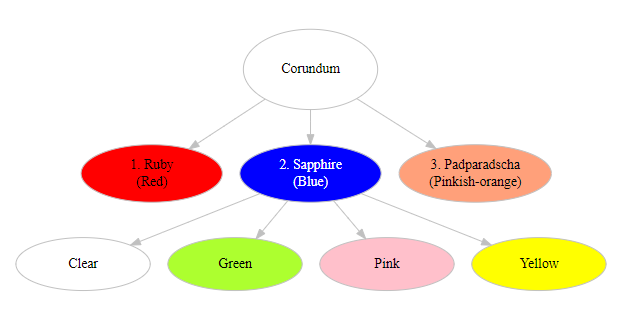

```{r setup, include=FALSE}
library(tidyverse)
library(knitr)
library(kableExtra)

opts_chunk$set(echo = FALSE, 
               fig.pos = "H", 
               out.extra = "", 
               fig.align = "center", 
               out.width = "90%")
knit_hooks$set(crop = knitr::hook_pdfcrop)
```

<!-- code for figure title reference -->
(ref:hall-citation) @hallGemstones2021
<!-- keep -->

# Assignment 2.1: {-}

## Describe fully the three named members of the Corundum family. {-}

The Corundum family consists of ruby, sapphire and padparadscha. Since they
belong to the same family, their physical and optical properties are the same
(except for colour) for each member. 

1. __The physical properties.__

To describe the physical properties of Corundum (see Figure \@ref(fig:image1)):
the natural chemical composition of Corundum is Aluminium Oxide (Al$_2$O$_3$),
also known as Alumina, which can be used for producing synthetic gemstones
(@britannicat.editorsofencyclopaediaAlumina2018). It has a trigonal crystal
structure meaning that when rotated, the 'aspect of symmetry' is seen three-fold
through a 360$^\circ$ turn on an axis. Corundum is very hard, measuring 9 on
Mohs' scale of hardness. This means that it can only be scratched by diamond
(Mohs = 10; [@hallGemstones2021, p. 54]), but is able to scratch any gemstone
with a smaller hardness measurement. Specific Gravity (SG) is a measure of
density, so with an SG of 4.00, Corundum will feel lighter than hematite
(SG: 5.20; [@hallGemstones2021, p. 100]) and heavier than obsidian (SG: 2.35;
[@hallGemstones2021, p. 136]) of similar sizes.

2. __The optical properties.__

  + 2.1 __Lustre, refractive index, and birefringence.__

The optical properties of Corundum include lustre, described as *vitreous*,
meaning a glass-like appearance which is common for cut gemstones. Refractive
index (RI), indicates how much light is bent through the gemstone; and
birefringence (DR) is a measure of the 'shadow edge' of the refractive light.
Corundum is doubly refractive, meaning the refractive light is split in two, the
difference between the two gives the DR measurement [@hallGemstones2021].
Figure \@ref(fig:image1) also shows the numerical values of these optical
properties.

```{r image1, fig.cap='The physical and optical properties of the Corundum family. Image: Author\'s own. Source: (ref:hall-citation)'}
include_graphics("./images/sapphire_properties.png")
```

  + 2.2 __Colour__

The final optical property of Corundum is colour. Figure \@ref(fig:image2)
displays the unique colours of ruby and padparadscha; and the various main
colours of sapphire. For ruby, the content of chromium and iron in the stone
determines the shade of red, from pink to brownish-red. It can also have a silky
appearance and sometimes renders a star effect, caused by rutile inclusions.
Padparadscha means *lotus blossom* in Sinhalese, and its pinkish orange colour
makes it very rare.

```{r image2, fig.cap='The three named members, and main colours of the Corundum family. Image: Author\'s own. Source: (ref:hall-citation)'}

```

As for sapphire, it is commonly found in differing shades of blue depending on
the amount of iron and titanium content. Blue sapphire and padparadscha are
often heat treated to improve the colours. Colourless sapphire is very rare and
has no impurities, though when treated with heat it produces blue sapphire.
Corundum containing alternating bands of blue and yellow sapphire creates shades
of green sapphire. The varying shades of pink sapphire depends on the quantities
of chromium impurities, though a deeper purple is produced with iron and
titanium content. Finally, the unusual shades of yellow sapphires: yellow,
orange, orange-yellow, and greenish yellow, make for alternative attractive
gemstones [@hallGemstones2021]. Coloured corundum is described as _allochromatic_.

```{r table data}
c <- tribble(
  ~Country, ~Red, ~"Pinkish orange", ~Blue, ~Colourless, ~Green, ~Pink, ~Yellow,
  "Myanmar", "Finest", "", "Good quality", "", "", "Yes", "",
  "Thailand", "Brownish", "", "Dark", "", "Yes", "", "Greenish",
  "Afghanistan", "Bright", "", "", "", "", "", "",
  "Pakistan", "Bright", "", "Good quality", "", "", "", "",
  "Cambodia", "Bright", "", "Yes", "", "", "", "",
  "Vietnam", "Bright", "", "Yes", "", "", "", "",
  "India", "Yes", "", "Good quality", "", "", "", "",
  "Sri Lanka", "Yes", "Yes", "Good quality", "Truly, & Cloudy", "Yes", "Yes", "Purely",
  "Mozambique", "Yes", "", "Yes", "", "", "", "",
  "Tanzania", "Yes", "Yes", "Yes", "", "", "", "",
  "Malawi", "Yes", "Yes", "", "", "Teal", "Yes, & Bright", "",
  "Greenland", "Yes", "", "", "", "", "", "",
  "Russia", "Yes", "", "Yes", "", "", "", "",
  "Australia", "Yes", "", "Dark", "", "Teal", "", "Greenish",
  "Norway", "Yes", "", "", "", "", "", "",
  "Montana (US)", "Yes", "", "Metallic", "Truly", "Teal", "", "Purely",
  "Madagascar", "", "Yes", "Yes", "", "", "Yes", "",
  "Kashmir", "", "", "Cornflower", "", "", "", "",
  "Nigeria", "", "", "Dark", "", "", "", "",
  "Brazil", "", "", "Yes", "", "", "", "",
  "China", "", "", "Yes", "", "", "", "",
  "Kenya", "", "", "Yes", "", "", "", "",
  "Canada", "", "", "Yes", "", "", "", "",
  "Columbia", "", "", "Yes", "", "", "", "",
  "East Africa", "", "", "", "", "", "Yes", "Purely"
) |>
  arrange(Country)
```

3. __Locations__

Corundum can be found in mines across the globe. Table \@ref(tab:table1) demonstrates the numerous locations of mines in countries and areas (East Africa) where it is economically viable to extract each type and colour of corundum. It can be clearly seen that blue sapphire and ruby are the most abundant gemstone of this family, whilst colourless sapphire is the least common, only found in Montana (US; truly colourless) and Sri Lanka (truly colourless; and cloudy).


``` {r table1}
kbl(c,
  align = c("l", "c", "c", "c", "c", "c", "c", "c"),
  booktabs = TRUE,
  centering = TRUE,
  caption = "Worldwide locations of Corundum"
) |>
  kable_paper() |>
  add_header_above(c(" " = 1, "Ruby" = 1, "Padparadscha" = 1, "Sapphire" = 5), bold = TRUE) |>
  column_spec(1, bold = TRUE) |>
  footnote(c("Descriptions denote type of colour. Examples: 'Bright' = bright red ruby; 'Teal' = teal green sapphire.",
      "'Yes' denotes coloured gemstone also found in corresponding country. Examples: blue sapphire can be found in Brazil; padparadscha in Malawi.",
      "Source: (ref:hall-citation).")) |>
  kable_styling(full_width = FALSE, 
                position = 'center',
                latex_options = c("scale_down", "HOLD_position"), 
                bootstrap_options = "striped")
```


## Why do you think these gemstones are so popular in jewellery? {-}

These gemstones are so popular in jewellery for numerous reasons. The variety of
colour alone is enough to make corundum popular. Colour is representative of
familiarity in human existence. For example, blue might represent sky, or sea;
green, grass and trees. Reds and pinks might inspire passion. There may be
superstitious attachments to these gemstones, for example, clear corundum might
be associated with purity, yellow with secrecy or generosity
[@marissamillerWhatOurObsession2017]. On the other hand, pink sapphire is
believed to ward off misfortune or illness [@hallGemstones2021, p. 97]. The
vitreous lustre would add to the gemstone's popularity, along with the type of
faceting. The round or oval brilliant cut is common for corundum as it reflects
the most light, giving brightness and fire. Ruby and padparadscha are often cut
with the mixed style, to a similar effect [@hallGemstones2021]. Both colour
and 'shiny' appeal to human psychological desire for jewellery, especially when
linked to some personal aspect of one's self. For example, purchasing a corundum
pendant because it represents your, or a partners, friends birthstone (ruby:
July; sapphire: September; @h.samuelBirthstones2023; @najGemstones2022).
Additionally, its hardness means that it is less susceptible to damage, so
wearing corundum jewellery should be less fraught with anxiety as it should not
be able to be scratched (unless caught by diamond; see above). Finally, as well
as the beauty aspect, well-presented corundum jewellery represents wealth as
ruby and sapphire are among the most valuable and popular gemstones
[@aremCorundumValuePrice2022].

# Assignment 2.2: {-}

## Imagine you have to give a short presentation to a discussion group who want you to talk about pearls. Write what you would say, in an interesting and informative way, covering the following details: {-} 

_(see items i, ii, iii below for the question details)_

  - Author's note: The following transcript is a draft of the [imaginary]
    presentation I will give at this up-coming [imaginary] discussion group.
    Hopefully I'll remember everything. I'm a bit nervous so no doubt I'll take
    notes with me. Memo to self: write presentation slides the night before the
    event (make sure laptop works and check venue has cables/projector, etc.,
    ready)!

[$Begin\space...$]

**Introduction**

"Good [morning/afternoon/evening]. Thank you for inviting me to this
discussion group and allowing me to give this short presentation about pearls.
I'm sure you all know about pearls: their desirability, beauty, retail value,
and how to sell pearl jewellery, so I'd like to talk more about how natural,
cultured and freshwater pearls are formed; what imitation pearls are, and how
they're made. For reference, I'll be using information from *The National
Association of Jewellers* [@najGemstones2022], *The Pearl Source* blog
[@jonasNaturalPearlsVS2017], *Jeweller Magazine*
[@saltonCreateCulturePearls2013], and two books: *"Gemstones"*
[@hallGemstones2021] and *"Stoned: $...$"* by Aja
@radenStonedJewelryObsession2016. If you have any questions afterwards, I'd be
happy to answer them."

"So, let's begin with how pearls are formed $...$"

## (i) How the pearls, natural, cultured and freshwater, [are] formed. {-}

"No matter which type of pearl, they are all formed in a similar way. That being
the oyster (or any mollusc, actually) protects itself when a parasite (or grit)
gets inside the shell, by coating the intruder in a substance called *nacre*
(pronounced, 'nay-ker'; [@najGemstones2022]). This produces the 'white' shiny
effect, in multiple layers, which make the pearl - one reason for different
sized pearls: more layers, larger pearls - I would imagine it depends on the
size of the parasite/grit, and how many layers of nacre the oyster reckons is
sufficient to feel 'safe'. So one way of looking at it is that a pearl is
effectively a dead thing in a natural coffin! Don't tell your customers that -
it might put them off a sale!" [*Polite chuckles ripple through the group*].

"However, if that is the basic formation of pearls, the differences between the
three types are: *Natural* pearls are generally harvested from oysters at the
bottom of the sea by specialist divers off countries like Bahrain in the
Middle-East [@jonasNaturalPearlsVS2017]. As a side note, I lived there in my
youth and have seen people actually dive for pearls [*Readers note:* true
story!]. It's a fascinating sight, and you wonder how they hold their breath
for so long - practice makes perfect, I guess! They don't use breathing
apparatus, dive with baskets, and use a rope attached to the boat for getting
back! [*Nods of approval*] $...$ And so, natural pearls are very rare since
most have been harvested (apparently) [@jonasNaturalPearlsVS2017], and
therefore very expensive - afforded only by the rich or famous. On that note,
@radenStonedJewelryObsession2016 tells the story of a world famous natural pearl
called *La Peregrina* (look it up), originally gifted to Mary I (sister of
Elizabeth I) , subsequently owned by the actor Elizabeth Taylor 400 years later.
A recommended book, if you fancy a good read."

"Moving onto *cultured* pearls. The production of cultured pearls is basically
'factory farming' of pearls. Again, the organic process is the same as natural
pearls, except the oysters are kind of force-fed an irritant in the form of a
'seed' [@najGemstones2022] and then left to 'do their stuff' in the usual way.
They are farmed in their thousands and, to be fair, it's a reasonable way to
ensure pearls are available to keep up with human desire for them. The process
was developed in the early Twentieth Century by a Japanese man named *Kokichi
Mikimoto*. Again, @radenStonedJewelryObsession2016 tells a fascinating narrative
of his life and eventual 'fame'. The other note about the formation of cultured
pearls is there are two types: 1. where the oyster has a bead inserted
(nucleated), and 2. the use of oyster tissue instead of a bead (non-nucleated)."

"Finally, *Freshwater* pearls are generally formed in mussels that, surprisingly
enough, live in streams and rivers, not salt-water seas. Again, same process as
natural and cultured pearls [@najGemstones2022]. They used to be small and
irregular-shaped, but now are rounder and larger making a good starting point
for pearl jewellery collection [@saltonCreateCulturePearls2013]."


## (ii) What are imitation pearls and how are they made? {-}

"The final topic is imitation pearls. If you've made it this far without falling
asleep, well done! Briefly then, so you can all go home: imitation pearls are
human-made, usually out of plastic or glass, and come in many colours. They are
inexpensive and can look real [@najGemstones2022], great for costume
jewellery, and looking fabulous on a night out. Some are realistic-looking
enough that people would never know at a glance! You can also find branded
imitation pearls - more expensive, but still cheaper than the real thing."

"So, that's the end. If you have any questions $...$"


## (iii) At the end of your presentation you are asked the following question: “How should I look after my pearls?” What advice would you give? {-}

"Okay. Thank you for the question. Well, generally, with great care! But more
specifically:

First of all, let's remember that pearls are not very hard. They're composed of
calcium carbonate (calcite; the chemical compound of nacre) and measure just 3
on Mohs' scale of hardness [@hallGemstones2021]. That means pearl can be
scratched by any gemstone except those of gypsum (Mohs = 2) and talc (Mohs = 1)
- so keep them away from other jewellery!"

"Secondly, avoid having pearls near make-up, hairspray and perfume as these
products could damage the surface of the pearl $...$

$...$ Thirdly, only clean with a soft cloth $...$

$...$ Fourthly, keep necklaces flat in the original box, and $...$

$...$ Finally, consider having a string of pearls inspected annually, as the silk
threads may also get stretched over time [@saltonCreateCulturePearls2013]."

"Remember: natural and cultured pearl jewellery is not cheap. It's worth the
extra effort to keep it looking its best, right?"

"Well $...$ I hope that's answered your question and that you've enjoyed this
short presentation as much as I've enjoyed sharing it with you. I'm sure I've
missed things out but there's so much information out there, I recommend you
have a look for yourselves. Thank you for having me."

[_Gentle applause_]

[$End.$]


Words: `r wordcountaddin:::word_count()`


# References {-}
