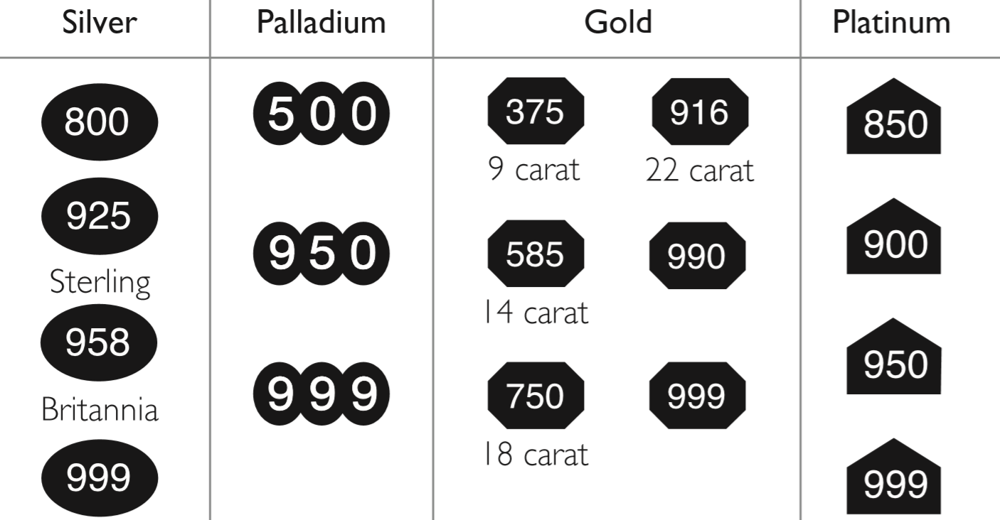
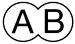

```{r setup, include=FALSE}
library(tidyverse)
library(knitr)
library(kableExtra)

opts_chunk$set(echo = FALSE, 
               fig.pos = "H", 
               out.extra = "", 
               fig.align = "center", 
               out.width = "75%")
knit_hooks$set(crop = knitr::hook_pdfcrop)
```

<!-- code for figure title reference -->
(ref:standards-citation) @thegoldsmithscompanyassayofficeWhatHallmark2023
<!-- keep -->

\

# Assignment 3.1: {-}

## Which metals have to be hallmarked and below what weights are these metals exempt from hallmarking? Include in your answer a list of all the different fineness standards permitted in the UK. {-}

The metals which have to be hallmarked are silver, gold, platinum and palladium.
Since 1 January 1999 in the UK, *The Standard Mark*, which is expressed
millesimally [@bradburyBradburyBookHallmarks2018], denotes the fineness (or
purity) of precious metal in parts per 1000; and each metal is identified by a
different shaped shield surrounding the numbers [@najHallmarking2022].

For example, the shield for silver is oval; for gold: horizontal
corner-cut-rectangle; platinum: a horizontal rectangle with a triangular top;
and palladium: three adjoining circles [@najHallmarking2022].

The numbers representing the fineness standard of each precious metal are as
follows: silver (800 parts/1000, 925, 958, 999); gold
(375, 585, 750, 916, 990, 999); platinum (850, 900, 950, 999); and palladium
(500, 950, 999). Each millesimal number can also be referred to as a percentage,
for example 925 Sterling silver consists of 92.5% silver content. It is worth
noting that 958 Britannia silver is actually 958.4/1000; and though the decimal
is removed, the fineness is never less than 958.4
[@bradburyBradburyBookHallmarks2018]. Figure \@ref(fig:image1) summarises the
shield types and fineness marks permitted in the UK, for each precious metal.

Articles weighing less than 7.78g (silver); 1g (gold); and 0.5g (platinum) are
exempt from assay and marking, though these must be at least of the minimum
legal fineness [@najHallmarking2022, p. 4].

\

```{r image1, fig.cap="Fineness marks permitted in the UK. Source: (ref:standards-citation)"}

```

# Assignment 3.2: {-}

## Describe all the marks that may be found on a 950 standard platinum ring hallmarked Birmingham in 2012 and clearly identify which are compulsory and optional. {-}

**Compulsory marks** (Images source:
@assayofficebirminghamCompulsoryHallmarks2023)

On a 950 standard platinum ring hallmarked Birmingham in 2012, I would expect to
see the following compulsory marks:

1.  A sponsor's mark. For example, Assay Birmingham:
    {height=7.5% width=7.5%}

2.  The 950 millesimal fineness mark (inside a horizontal rectangle with a
    triangle top): {height=7.5% width=7.5%}

3.  The Birmingham Assay office mark (horizontal anchor):
    {height=6% width=6%}

\

**Optional marks** (Images source: @assayofficebirminghamOptionalMarks2023)

Optional marks may include the following :

1.  The platinum mark. An Orb surmounted by a Cross
    [@bradburyBradburyBookHallmarks2018, p. 27]:
    {height=6% width=6%}

\

Depending on the date in 2012, for example, if assayed from July 2011 -
October 2012,

2.  The Diamond Jubilee mark (portrait of Elizabeth II inside a diamond on a
    circle): {height=6% width=6%}

\

Or if assayed in November or December 2012

3.  The Date mark (a lower-case 'n' in a corner-cut square):
    {height=6% width=6%}


# Assignment 3.3: {-}

## A Convention Hallmark is an alternative hallmark to a UK domestic hallmark. Explain why a sponsor or manufacturer within the UK may request such a hallmark and describe the four marks it comprises of. {-}

A sponsor or manufacturer in the UK may request a *Convention Hallmark* when
exporting precious metal wares to any of the 20 Member States of the Hallmarking
Convention. Current member States are: Austria, (Croatia, from 19 March 2018;
[@bradburyBradburyBookHallmarks2018, p. 44]) Cyprus, Czech Republic, Denmark,
Finland, Hungary, Ireland, Israel, Latvia, Lithuania, The Netherlands, Norway,
Poland, Portugal, Slovak Republic, Slovenia, Sweden, Switzerland and United
Kingdom (UK) [@bradburyBradburyBookHallmarks2018, p. 44; @najHallmarking2022,
p. 3].

The Convention Hallmarks were introduced in 1976 to help prevent problems with
hallmarking imported goods to the UK; and exporting items where the UK
hallmarking was not legally recognised [@bradburyBradburyBookHallmarks2018].

In addition to the

1.  registered sponsor mark

the convention hallmark includes:

2.  A common control mark: the fineness number (parts/1000) between a set of
    scales, surrounded by a shield shape-dependent on metal type (for example,
    gold = two adjoining circles).

3.  A standard of fineness: the fineness number (parts/1000) repeated for
    clarity (no background/shield; see Table \@ref(tab:table1)).

4.  The Assay Office mark (UK or Convention member): for example, London = the
    leopard head in a corner-cut square shield
    [@bradburyBradburyBookHallmarks2018; @najHallmarking2022].

```{r table1}
fine <- tribble(
  ~Silver, ~Gold, ~Platinum, ~Palladium,
  "800", "375", "850", "500",
  "925", "585", "900", "950",
  "958", "750", "950", "999",
  "999", "916", "999", "-",
  "-", "990", "-", "-",
  "-", "999", "-", "-",
  )

kbl(fine,
  booktabs = TRUE,
  centering = TRUE,
  caption = "Standard of fineness marks"
) |>
  kable_paper() |>
  kable_styling(full_width = FALSE, 
                position = 'center',
                latex_options = c("HOLD_position"))


```


# Assignment 3.4: {-}

## Discuss the benefits of Fairtrade gold, detailing a designer or manufacturer who promotes this. {-}

In order to discuss the benefits of Fairtrade gold it should first be
acknowledged that conventional gold mining can cause environmental and social
problems. @changFairtradeGoldWhy2021 further explains that chemicals used in
conventional mining eventually end up in local rivers and water-tables; and that
mining gold produces vast amounts of soil waste. In addition to these
environmental problems, social issues affect the miners and their families
though lack of worker's rights, risking injury or death; destruction of the
local economy; and disadvantaging female workers in favour of male miners.

This is where Fairtrade gold seeks to redress the balance of these issues.
Therefore, the benefits of Fairtrade gold include helping to protect the local
environment; and ensuring small-scale workers are treated fairly and fair deal
for their hard work [@fairtradefoundationGold2023;
@najGoldPlatinumPalladium2022]. The official Fairtrade Gold Standard
[@fairtradeinternationalFairtradeStandardGold2013] sets out the intent,
requirements and guidance for the trade and production of Fairtrade gold, which
applies to certified artisanal and small-scale mining organizations from
countries in the southern hemisphere (Latin America; Africa; the Middle-East; and
Asia), and traders who buy and sell their wares. Specific benefits include (and
are not limited to): protection of worker's health and wellbeing, protection of
women's and children's rights; protection of the environment, for example, no
use of chemicals; no support of armed groups; documented traceability of gold
from source; use of the Fairtrade mark which shows ethical support for Fairtrade
endeavours. The @fairtradefoundationGold2023 lists 24 (of over 300) jewellers
who are part of their licensee scheme, one of whom is *Harriet Kelsall*.

@harrietkelsallFairtradeGold2023 is proud and honoured to be a Fairtrade
jeweller. They were initially asked by Fairtrade to help with the process of
connecting smaller jewellers; and with nineteen others, launched Fairtrade gold
worldwide. Their customers who opt for jewellery made with Fairtrade gold pay a
small premium which goes directly to the Peruvian miners to use how they wish
[also see @najGoldPlatinumPalladium2022, p. 7]. Kelsall compares the cost to a
meal-out-for-two, a small price to pay for the customer to know they are helping
to make a difference. There is no company profit made from this transaction, and
an official Fairtrade stamp is also issued by an Assay Office on their Fairtrade
gold jewellery. In her statement, @harrietkelsallFairtradeGold2023 is also
"committed to educating people" about the benefits of Fairtrade gold over
'standard' gold, and hopes that demand will become high enough to permanently
use Fairtrade gold.

# Assignment 3.5: {-}

## Explain as you would to a colleague or customer the differences, properties and benefits of white-gold, palladium and platinum. {-}

"White-gold, palladium and platinum are basically classed as 'the white metals'
and are popular for engagement and wedding rings
[@coreyeganWhiteMetalsComparison2023; @giaWhiteGoldPlatinum2015]. I have three
rings here, one of each type - simple wedding bands, and whilst they look
similar, some of their differences and properties are not obvious at first
glance. So let's talk about some of the differences between them before moving
onto their properties and benefits."

**Differences**

"This white-gold ring, for example. You can tell the metal type and fineness by
looking at the hallmarks through a loupe. See the 750 in a corner cut rectangle?
That's 18ct (75%) gold - we'll get on to how it's called white-gold when we talk
about properties. The difference in the platinum ring is the 950 fineness (95%
platinum) in a rectangle with a triangular top; and the palladium one has 950
(95% palladium) in three adjoining circles (which shows it was made after
January 2010 [@bradburyBradburyBookHallmarks2018], otherwise the number would
be in a trapezium shape. If you look closely, you can just about make out that
platinum has the whitest colour over palladium and white-gold, and ironically,
white-gold has the least whitest colour of them all [see
@coreyeganWhiteMetalsComparison2023 for further comparisons]."

**Properties**

"White-gold is generally made by alloying gold with silver or palladium
[@najGoldPlatinumPalladium2022], and can be rhodium plated to give a whiter
finish [@coreyeganWhiteMetalsComparison2023]. Palladium is more scratch
resistant than both white-gold and platinum. Platinum and palladium are both
hypo-allergenic because they are purer than white gold and do not contain
nickel. Palladium is a by-product of platinum mining
[@giaWhiteGoldPlatinum2015], and is 40% lighter
[@najGoldPlatinumPalladium2022] than platinum [SG: 21.40; @hallGemstones2021,
p. 52], which is heavier than gold [SG: 19.30; @hallGemstones2021, p. 48].
All three metal types obviously have a metallic lustre."

**Benefits**

"As for the benefits of each metal type, all three are durable though palladium
is the most scratch resistant. White-gold may have the lower cost due to the
least amount of pure metal, but platinum is rarer and weighs more
[@coreyeganWhiteMetalsComparison2023]. On the other hand, palladium has the
lightest weight so can be used to make larger pieces of jewellery
[@najGoldPlatinumPalladium2022]. Platinum is also very strong and less brittle
than white-gold which is good for setting diamonds
[@giaWhiteGoldPlatinum2015]. Platinum and palladium are also less likely to
tarnish."

Words: `r wordcountaddin:::word_count()`


# References {-}
