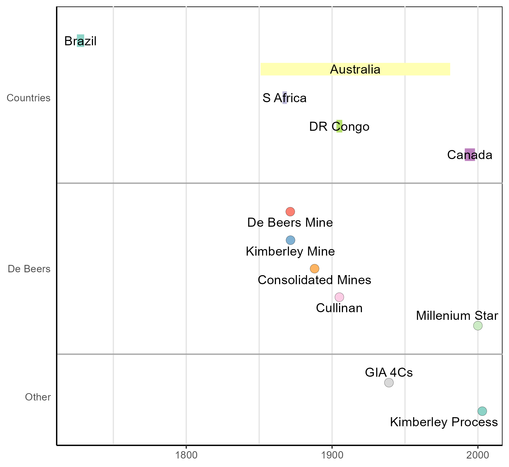
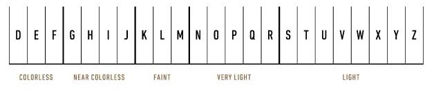
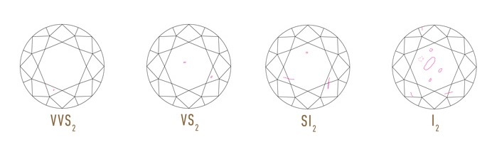
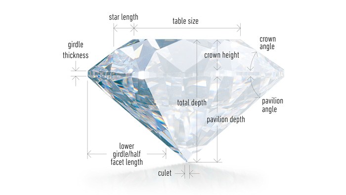

```{r setup, include=FALSE}
library(tidyverse)
library(knitr)
library(kableExtra)

opts_chunk$set(echo = FALSE, 
               fig.pos = "H", 
               out.extra = "", 
               fig.align = "center", 
               out.width = "80%")
knit_hooks$set(crop = knitr::hook_pdfcrop)
```

# Question 1.1 {-}

## i) Give a brief summary of diamonds formation include a timeline of first discoveries {-}

The formation of diamonds occurred in the Earth's mantle a long time ago
(roughly between 3.5 billion to 900 million years), deep below the surface
(around 150km), where incredible pressure and heat compacted carbon into
diamonds. Pipes formed by the movement of kimberlite or lamproite molten rock
transported the encapsulated diamonds to the surface, where they appeared via
small volcanic eruptions. The diamonds were cooled quickly during these
eruptions, and the primary deposits, whereby the rough diamonds are still
enclosed in kimberlite rock, are mined by open-cast or underground mining
techniques [@najDiamonds2022].

Secondary deposits are caused by weather or water erosion of the solidified
rock, revealing the diamonds on the ground. Rough diamonds transported by rivers
(known as alluvial deposits) are panned by hand, where higher quality stones are
found due to diamond's hardness (Moh's scale: 10, @hallGemstones2021, p. 54)
and resilience [@najDiamonds2022].

Figure \@ref(fig:firsts) visualises a brief timeline of first discoveries. The
upper section includes countries where diamonds were first discovered, and the
length of the line indicates time between discovery and the beginning of
production. For example, Brazil (diamonds discovered in 1725, production started
in 1730); Australia (1851, 1981); South Africa (1866, 1869); DR Congo (1903,
1907); Canada (1991, 1998). It is worth noting that diamonds were found in India
during ancient times [@najDiamonds2022] and were first mined over 4000 years ago
[@dundekDiamonds2022, p. 11]. Modern dating constraints prevent the inclusion of
India on Figure 1.

```{r firsts, fig.cap="Timeline of First Discoveries. Image: Author's own. Sources: [@debeersBeersDiamondHistory2023; @giaWhatGIAPosition2023; @najDiamonds2022]", out.width="100%"}



```

The mid section of Figure \@ref(fig:firsts) shows a selection of first mine and
diamond discoveries achieved by De Beers and the Diamond Trading Company: De
Beers mine (May 1871); Kimberley mine[^1] (July 1871); Consolidated Mines Ltd
established (March 1888); the *Cullinan Diamond* (3,106.75 carats, 1905); and
the unveiling of the *Millennium Star*, a pear-shaped cut diamond at 203.04
carats, 2000; [@debeersBeersDiamondHistory2023]. The lower section 'firsts'
included the development of the 4 C's by De Beers in partnership with with the
Gemological Institute of America (GIA), 1939 [@debeersBeersDiamondHistory2023];
and the establishment of the Kimberley Process Certification Scheme to block the
flow of conflict-diamonds, 2003 [@debeersBeersDiamondHistory2023;
@giaWhatGIAPosition2023].

[^1]: The Kimberley mine is located in South Africa and should not be confused
    with the Kimberley Region of North Western Australia, where the Argyle
    diamond mine was operational between 1983 and 2020
    [@wikipediaArgyleDiamondMine2023].

\newpage

## ii) What are the 4 C's give full details using the GIA grading system. {-}

The 4 C's is a commonly known phrase associated with the four main
characteristics of a diamond to determine its quality and value. Developed by De
Beers in partnership with the GIA (see above) as the first universal diamond
grading system, the 4 C's are *Colour*, *Clarity*, *Cut*; and *Carat*
[@dundekDiamonds2022; @najDiamonds2022]. Each is detailed below:

**Colour:** Colour is an important consideration when determining the quality
and value of a diamond. Ironically, *no* colour is the ideal, as *colourless*
diamonds are the rarest and most desirable, graded as 'D' on the GIA Colour
Scale (see Figure \@ref(fig:colour)). The scale descends to the letter 'Z' which
has a slight hint of yellow or brown hue [@dundekDiamonds2022]. Colour can be
gauged by looking at a diamond table (through a loupe) from the top, viewing the
side of the stone above the girdle, under certain lighting conditions
[@najDiamonds2022]. Even though the colour grading is compared to a known
pre-graded master stone, it must be difficult to determine the difference
between a 'D' and 'E' grading, even for a trained and experienced gemologist.

```{r colour, fig.cap="The GIA Colour Scale. Source: based on @giaDiamondColor2023"}

```

Not all diamonds are colourless or have varying shades of faint to light yellow.
*Fancy colour* diamonds are also rare and have a full hue of various colours
such as, blue, yellow, brown, green, pink, purple; and the very rare red
[@dundekDiamonds2022, p. 18]. These are graded on hue, tone, saturation and
distribution of colour [@najDiamonds2022, p. 10].

In addition to the GIA Colour Scale, other grading systems are available; and
they have equally narrow margins. For example, The World Jewellery Confederation
(CIBJO) grades 'D' as "Exceptionally White (+), 'G' as$\space$"Rare White" and 'M' to
'Z' as "Tinted" [@dundekDiamonds2022; @najDiamonds2022].

**Clarity:** A diamond's clarity is indicated by its degree of flawlessness. A
skilled grader can identify external imperfections (blemishes) and internal
objects (inclusions), usually through a 10x loupe, in ideal lighting conditions
[@dundekDiamonds2022; @najDiamonds2022]. Table \@ref(tab:clarity) lists the GIA
grading of clarity from $FL$: no inclusions or blemishes; $IF$: internally
flawless with minor surface blemishes; to the lower grades (3-6) with inclusions
increasing in quantity and size to $I_3$ (see Figure \@ref(fig:inclusions) for
examples).

The fewer imperfections in a diamond, the rarer it is, so it stands to reason
that flawless diamonds are incredibly rare, and therefore fetch a higher price
[@dundekDiamonds2022; @najDiamonds2022].

```{r clarity table data}

clar_tab <- tribble(
  ~Description, ~Code,
  "Flawless", "$FL$",
  "Internally Flawless", "$IF$",
  "Very Very Slightly Included", c("$VVS_1$", "$VVS_2$"),
  "Very Slightly Included", c("$VS_1$", "$VS_2$"),
  "Slightly Included", c("$SI_1$", "$SI_2$"),
  "Included", c("$I_1$", "$I_2$", "$I_3$")
)
```

```{r clarity}

kbl(clar_tab, booktabs = TRUE, row.names = TRUE, escape = FALSE,
      caption = "The GIA Clarity Scale in table format. Source: based on @giaWhatDiamondClarity2023") |> 
  kable_classic() |> 
  kable_styling(full_width = FALSE)
```

```{r inclusions, fig.cap="Examples of Inclusion Differences. Source: @giaWhatDiamondClarity2023"}

```

**Cut:** Facets are cut on the surface of a diamond between the girdle and the
table (crown); and below the girdle (pavilion) - see Figure \@ref(fig:dcut). The
cut is the only one of the 4 C's to be made by human contact, the others by
nature [@dundekDiamonds2022; @najDiamonds2022].

```{r dcut, fig.cap="The Sections of a Cut Diamond. Source: @giaDiamondCut2023"}

```

The importance of a well cut diamond shows how effectual the light is that
reflects through it. An ideal cut reflects most light back through the table due
to the perfection of the percentages and angles; a shallow cut, through the
lower girdle towards the culet; and a deep cut reflects more light through the
side of the pavilion.

The GIA diamond cut grading scales range from *excellent*, *very good*, *good*,
*fair*, to *poor* [@giaDiamondCut2023]; and an excellent cut will give the best
of the following important attributes:

-   **Brilliance:** total light reflected.
-   **Fire:** the 'rainbow' effect of the colour spectrum.
-   **Scintillation:** the 'sparkle' effect when viewed from different angles
    [@dundekDiamonds2022; @najDiamonds2022].

Visually spectacular, an excellent-cut diamond with perfect proportions will
command the highest value.

**Carat:** Carat (ct) refers to the weight of a diamond, not its size. 1ct
weighs 200milligrams; and is divided into 100 points, therefore a half-carat
(0.5ct) diamond is 50 points. Whilst an important factor in determining a
diamond's value, two diamonds of the same weight may be valued differently
depending on the qualities of the other 4 C's [@dundekDiamonds2022;
@najDiamonds2022].

A calculated weight of a loose stone must be described as calculated weight.
This involves measuring the length, width and depth with a micrometer,
calculated with specific formulae, dependent on the style of cut.

If the stone is set and the weight can only be estimated, it must be described
as estimated weight. There are specialist tools for this measurement
[@najDiamonds2022].

Finally, if there were a fifth 'C', it would be **certificate**. The GIA (and
other grading labs such as, the International Gemological Institute, IGI) issue
certificates for diamonds above 1 carat; and a Dossier for those below. The
dated certificate details the 4 C's with standard characteristics of the
diamond, including cut-style, measurements, grading and proportions. This
uniquely numbered certificate is linked to the lab's database, and is vital for
identification, insurance, and preventing fraud [@dundekDiamonds2022;
@najDiamonds2022].

## iii) Describe five popular diamond shapes. {-}

Between Roman times and circa 1400CE, diamonds were not cut but set in jewellery
in their natural from. Eventually, diamond cutting developed sufficiently enough
to show off the play of light using facets with improved angles. Even though
diamond cuts are refined with new technology to create new shapes and improved
'brilliance', some of the popular shapes have stood the test of time. The shape
of a diamond is observed from above the table, five of these shapes are
described below (information from [@dundekDiamonds2022; and @najDiamonds2022]).

**The Round Brilliant cut:** With 57 facets, or 58 with a culet, this round
shape remains very popular, as it has been cut for centuries. Perfected in 1919
by Marcel Tolkowski [@dundekDiamonds2022, p. 29] to achieve the best brilliance,
fire and scintillation, the round brilliant accounts for $3/4$ of all diamonds
sold today.

**The Emerald cut:** Most commonly rectangular shaped, sometimes square (both
with faceted corners), this step cut type is not a 'glittery' as the round
brilliant, though it displays glorious flashes of light in its rows of long
facets. This elegant, long cut is more suited to high quality diamonds,
otherwise inclusions or low colour may be more evident.

**The Oval cut:** This variant of the round brilliant gives a similar brilliance
and was created by Lazare Kaplan in the 1960s [@dundekDiamonds2022, p. 32]. The
oval shape is very flattering and gives the impression of a longer finger (when
mounted in a ring).

**The Heart Shape cut:** Another shape based on the round brilliant, this
universal symbol of love is popular for engagements and other special occasions.
Symmetry is vital in this complex fancy-cut, if the perfect brilliance is to be
achieved.

**The Princess cut:** This square modified brilliant, similar to a round but
with more triangular facets, is a popular fancy-cut as the 78 facets produce a
greater brilliance. The vulnerable points of the perfect $90^\circ$ corners
require protection to prevent damage.

## iv) What is meant by System of Warranties and the Kimberley Process? {-}

Beginning in 2000, the Kimberley Process (KP) was finally established in 2003
(see Figure \@ref(fig:firsts) and subsequent text) to prevent conflict diamonds
entering the global supply chain [@debeersBeersDiamondHistory2023;
@giaWhatGIAPosition2023; @kimberleyprocessWhatKimberleyProcess2023;
@najDiamonds2022]. The process was initiated after the 1998 *A Rough Trade*
report that exposed rough diamonds were funding civil war in Angola, and other
African nations [see @alleyAngolaBloodRocks2022;
@globalwitnessRoughTradeRole1998].

A UN mandate uniting 85 countries and 59 member countries, overseen by 13
official observers, ensures and maintains KP programs, such as:

  - Satisfy minimum requirements
  - Establish national legislation and institutions
  - Control import & export
  - Be transparent in practices
  - Exchange data
  - Trade only with fellow members
  - Certify shipments as conflict-free
  - Provide supporting certification

Currently, 99.8% of global diamond production is conflict free
[@kimberleyprocessWhatKimberleyProcess2023].

The System of Warranties was introduced by the
@worlddiamondcouncilSystemWarranties2022 as a system of self regulation to
support the KP in the buying and selling of diamonds. The warranty includes that
diamonds bought are:

  - Purchased from legitimate sources
  - Not involved in funding conflict
  - Compliant with UN resolutions

and that sellers of diamonds should guarantee the diamonds are conflict free,
whether by knowledge or certification [@najDiamonds2022].

Although set up with good intentions, the KP is not without controversy. In
2011, Global Witness stepped down as an official Observer due to the scheme
failing in three tests regarding Côte d'Ivoire, Venezuela; and Zimbabwe
[@globalwitnessGlobalWitnessLeaves2011]. More recently, the Civil Society
Coalition called for the KP definition of conflict diamonds to include *all*
violations of human rights, whomever in the diamond industry they are committed
by [@yoboueCivilSocietyOpening2023]. An example of which might include the
unfair distribution of wealth keeping participant countries, such as Botswana,
in poverty [@dubeBotswanaPresidentLaunches2023].


# Question 1.2 {-}

## Describe fully the process for making a hand-fabricated ring and a cast ring. Discuss the differences and benefits for each method. {-}

**Hand-fabricated ring:** The following basic stages describe one way of
creating a hand-made ring [@najManufacturing2022]:

  - The precious metal is annealed to make it malleable and workable.
  - If a setting is required to hold a gemstone, that is made first.
  - The shank is made by milling, hammering or forging the metal into the shape
    of the ring.
  - All measurements are checked with the specific design.
  - Joins, if any, are soldered together.
  - The ring is sent to be hallmarked at an assay office.
  - Once returned, the ring is reworked and sizes checked.
  - The ring is buffed before pre-polishing, and made ready for any setting or
    engraving.
  - After setting and/or engraving, the ring is rebuffed.
  - The final polishing and finishing completes the ring.

**Cast ring:** The lost-wax casting method [@najManufacturing2022]:

  - A master pattern-maker creates a master pattern from silver, to design
    specifications.
  - A mould is made by layering the master pattern (attached to a metal post
    called a branch or sprue) in rubber, which is heated, encasing the ring.
    Once cooled, the rubber mould is cut in half. With the master removed, the
    two halves are clamped together.
  - Hot wax is injected into the mould. Once cooled, the wax is the same shape
    as the master.
  - This wax replica is then attached to a thicker wax post with other replicas,
    creating a tree-like structure.
  - The whole 'tree' is placed in a can with the 'trunk' kept accessible. White
    liquid called *investment* is poured in and air bubbles removed. Once set,
    the wax is melted out inside an oven, leaving a cast.
  - Once cooled, molten metal of design choice is poured into the cast.
    Centrifugal force ensures the metal reaches all parts of the cast, which is
    not visible.
  - More cooling, and the investment is removed, leaving the pieces to be cut
    from the 'tree' for finishing.
  - Finishing involves checking the cast article matches the original design,
    hand-filing, buffing, polishing, setting (if necessary), and final
    polishing, by hand.

Each method of making rings requires experience and expertise, and despite the
obvious differences in production, there are more subtle differences, and
benefits of each method. Some of the differences are that hand-made rings are
unique as each one is crafted individually, whereas the mould of a cast ring can
be used time and again to make multiple rings. Hand-made rings can be made from
mixed-metals, cast ones can only use one metal per mould. Hand-made rings are
more expensive to purchase due to the amount of work that goes into making the
ring. Cast, being less expensive, with the potential to mass produce. A few
benefits of each would include being proud of wearing a hand-made ring,
especially if you were involved in the design process, a bespoke, one-off item
that no one else possesses. On the other hand, pleased to wear a cast ring
because, although it looks good on your finger, you know you can easily replace
it if it gets lost, or damaged [@najManufacturing2022].


# Question 1.3 {-}

## Name a jewellery designer and describe their styles, inspirations and preferred methods of manufacture. {-}

The jewellery designer chosen for this final question is
@rachelgalleyRachelGalleyEst2021, after reading the module document, *Design*
[@najDesign2022, p. 20]. After studying Jewellery Design in Central Saint
Martins College of Art and Design, London, Rachel Galley designs and creates
exceptional jewellery for everyone, for everyday wear at affordable prices. Her
designs have won many awards since starting the business in 2009
[@rachelgalleyUs2021; @rachelgalleyLookJourneyRachel2021], and she is well
known for her popular *Latticework* design
[@rachelgalleyLatticeCollection2021].

Key words that describe Rachel Galley's style are: *elegant*, *timeless appeal*
and *contemporary charm* [@rachelgalleyLatticeCollection2021]. Many styles
compliment these descriptions, as can be seen from the 'collections' link in the
main website's 'shop' [see @rachelgalleyRachelGalleyEst2021], used in designs
for most items of jewellery including rings, earrings, bangles, chains and
pendants. A few examples of the company's large array of styles include:

1.  The *Candy* collection that was designed to represent people's 'love and
    adoration for candy' [@rachelgalleyCandyCollection2021], blending fun and
    elegance to daily style.
2.  *Sandblast Texture* uses a sandpaper-like finish to give the impression of
    glittering "like it's studded with a million crystals"
    [@rachelgalleySandblastTextureCollection2021].
3.  *Ocean Wave* utilises the signature *Latticework* blended with a new texture
    to imitate "the movement and light of the calming ocean"
    [@rachelgalleyOceanWaveCollection2021].

Other designs that complete the collections are: *Surf Moon; Amore Heart; Molto;
Allegro; Versa; Love Link; Dew, and Grecian*. Each is inspired by her travels,
nature and surroundings [@rachelgalleyLookJourneyRachel2021], which can be
imagined in the finished pieces. Rachel Galley's inspiration from nature is also
extended to her commitment to sustainability.

Responsibly sourced gold and silver, natural gemstones, community initiative and
sustainable packaging are part of Rachel Galley's "giving back" programme,
including reducing hunger for children in India and the UK
[@rachelgalleyOurCommitmentSustainability2021], and providing educational
opportunities. Rachel Galley's parent company,
@vaibhavgloballimitedGlobalOperations2023, are involved in many sustainability
projects including, solar, rainwater harvesting, tree-planting and waste
management [@rachelgalleyWhatSustainableEthical2021]. They also operate an
convenient e-commerce channel, @tjcTJC2023, giving Rachel Galley another outlet
for her jewellery made in 925 Sterling silver; 18K gold vermeil [see
@rachelgalleyWhat18KGold2023], studded with AAA grade natural gemstones; and
SI.GH IGI certified diamonds [@rachelgalleyUs2021].

All of Rachel Galley's jewellery is designed in London and then sent to Jaipur,
India, for making by expert craftsmen and other specialising professionals
[@rachelgalleyRachelGalleyJewellery2021]. Their local design team in India
finalises each design in 3D modelling, wax design and then the finished product.
Jewellery is manufactured with a cast method using rubber moulds, perhaps as
described in question 2 above, though not specified. All articles are
double-checked through quality control before shipping, and include
certification and quality stamps.

Overall, Rachel Galley's passion for jewellery making can be seen in her
reflected inspirations and ethical practices, complimented by her commitment to
caring for the environment and local communities, whilst bringing unique designs
to people at affordable prices.


Words: `r wordcountaddin::word_count()`

# References {-}


